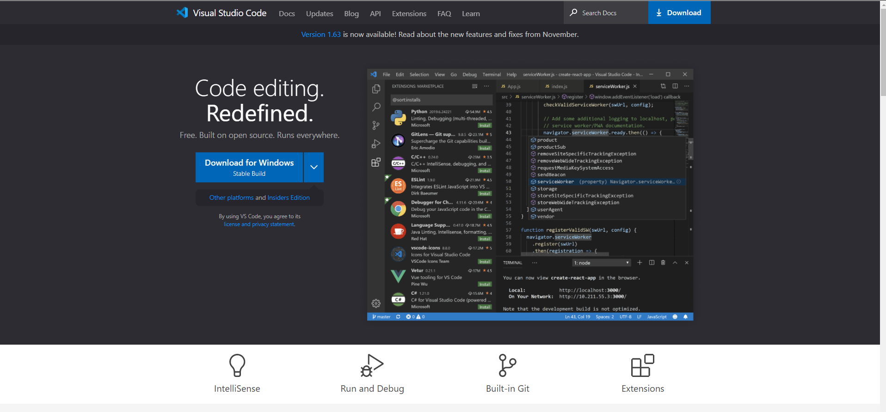
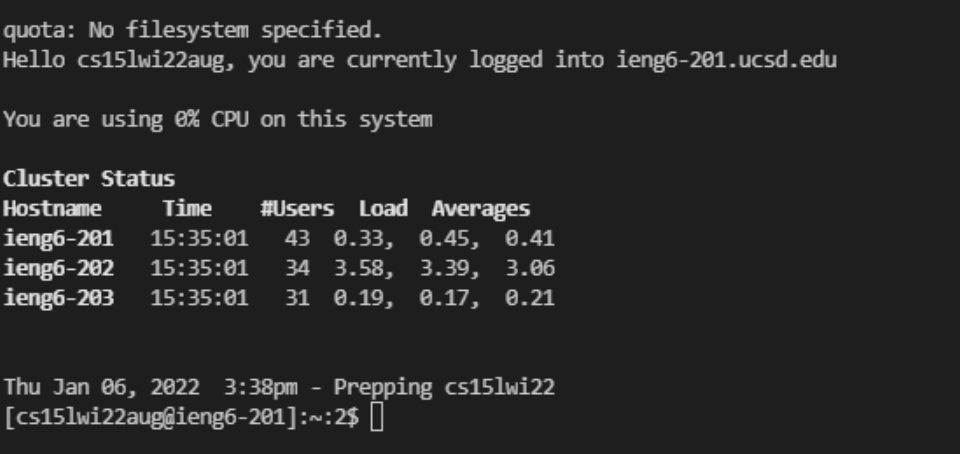
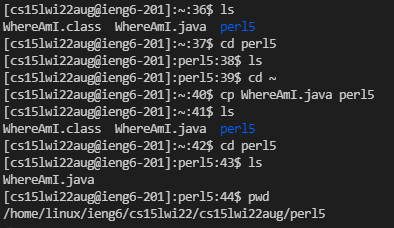
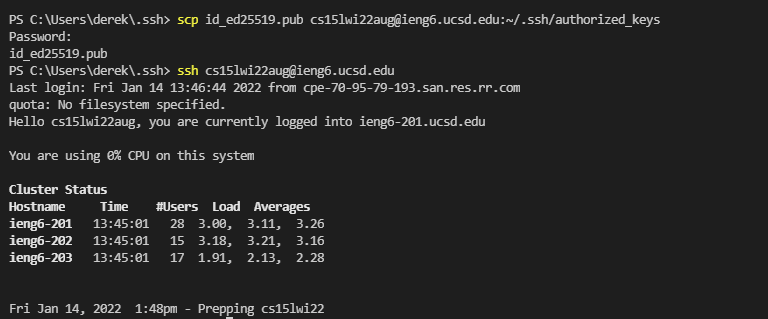
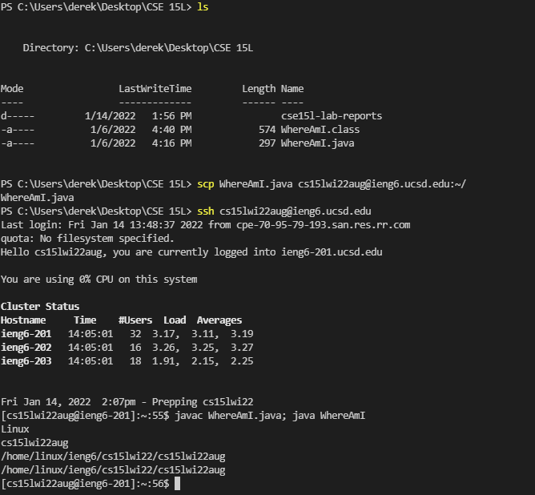

# Derek Ma Lab Report

Hello! This is my lab report with the topic on remote access.

## Installing VSCode

To install VSCode, or Visual Studio Code, we need to go to the VSCode website, which you can access at [https://code.visualstudio.com/](https://code.visualstudio.com/). 

The website should look something like this:

Follow the blue "Download" button on the top right and download the appropriate version that you need to install for your operating system. Once you download the installer, follow the instructions, and VSCode should be installed into your system.

## Remotely Connecting

To remotely connect, make sure you have OpenSSH installed on your system. If you are unsure if you have OpenSSH installed, refer to the instructions [here.](https://docs.microsoft.com/en-us/windows-server/administration/openssh/openssh_install_firstuse)

Once OpenSSH is installed, find your course-specific account for CSE15L, which can be found [here.](https://sdacs.ucsd.edu/~icc/index.php)

Once you find your login information, open up the terminal and type in this command:

"ssh cs15lwi22aug@ieng6.ucsd.edu"

Of course, the address itself will be slightly different for each user, but it should look very similar. Press enter, and if you are connecting for the first time, you will likely get a message that asks you if you are sure you want to connect to this server. Enter "yes" to continue the connection process. Then type in the password, and you should be logged in. Your screen should look something similar to this:

## Trying some commands

Now that your computer is connected to one of the computers in the UCSD CSE basement, you can try out some commands in your computer (the client) and it will execute those commands remotely on the computer you're connected to (the server).

Let's try these commands:

* ls - This will list all the files in the current directory (ls stands for list)

* cd [target directory] - This change the current directory to the target directory (cd stands for change directory)

* pwd - This will print the current directory that you are in (pwd stands for print working directory)

* cp [file] [target directory] - This will copy (cp) the file that you have and move it to the target directory.

Here is a screenshot of me playing around with these commands. As you can see, I copied a file from the home directory into perl5, changed the directory into perl5, listed the contents of the directory, and then printed the working directory.

## Moving Files with "scp"

You can also copy files between the client and the server, but instead of using "cp" (copy), you will be using "scp" (secure copy). The difference between cp and scp is that you will need to enter a password to secure copy a file from the client to the server.

To use scp, you will need to log out of the server and go to the directory on your local machine to find the file you are looking for.

Now use the scp command in this syntax:

"scp [file name] [server address: directory]"

For my case, I have a file called "WhereAmI.java" on my local machine. I want to move it to the home directory of "cs15lwi22aug@ieng6.ucsd.edu". So, I would type this command:

As you can see, after running the command, it prompted me for the password to login to the server. After entering the password, the file was successfully copied from my local machine onto the server.

## Setting an SSH Key

If you are using windows, follow the directions [here.](https://docs.microsoft.com/en-us/windows-server/administration/openssh/openssh_keymanagement#user-key-generation)

Login to the server using ssh, and create a new directory called .ssh by typing the command "mkdir .ssh". Then, log out of the server.

Locate the directory of the public key that you created, and copy it into the .ssh/authorized_keys directory on the server using the "scp" command. Here is a screenshot of the scp part.

As you can see from this screenshot, I no longer need a password to log in to the server.

## Optimizing Remote Running

For java files, you have to execute multiple commands in order to run the file. First you need to compile the file using the "javac" command, and then you would run the file itself by using the "java" command. If you are making constant changes to a java file, this may be tedious. However, since we can run multiple commands on the same line, and we have to run these 2 same commands every time in order to run the file, why not combine them both into one line?

For "WhereAmI", we could simply combine both commands into "javac WhereAmI.java; java WhereAmI". This will make running slightly easier. Of course, you would first make changes to the file on the local machine and then secure copy it to the server, but once you do that, you can log in using ssh, and then just type "javac WhereAmI.java; java WhereAmI", and run both commands at the same time. You can also use this command on your local machine to run the files on your local machine faster, too.

As you can see, instead of having to type 2 commands to compile and then run the file, we only needed to type one. Small but decent improvement!