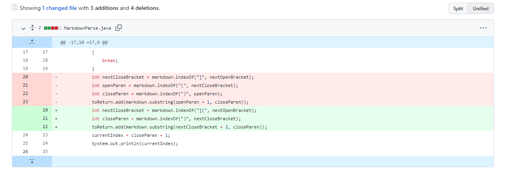
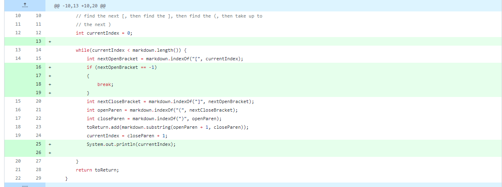
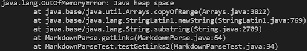
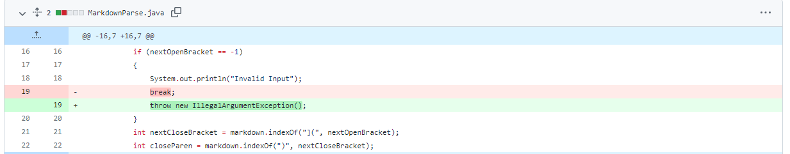
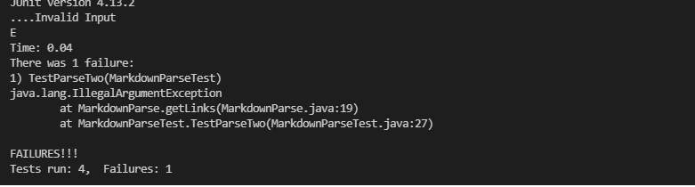

# Derek Ma Lab Report 2

Hello! This lab report demonstrates 3 code changes that our group did in labs 3 and 4.

## Code Change one

Screenshot of code change diff:

Link to test file for this failure-inducing input:

[test2.md](https://raw.githubusercontent.com/Prodlax/markdown-parse/ccc40cabe3dcb0edf868570196ae4491a0388432/test2.md)

Command + Symptom of failure inducing output:

`java MarkdownParse test2.md`

`[, hello.html]`

Explanation:

For this output, we had a set of `[]` and `()` that was seperate from each other but in succession. The way our programs output before the change is that it looks for the characters `` in that order and takes the link, which is whatever is in between `()`. However, `` in that order may not actually refer to a link, as shown in test2.md (we have an array and then a pair parenthesis thrown in the file). The symptom we get is an unexpected output: we are expecting `[hello.html]`, but in reality we get `[, hello.html]` since our output detects the links improperly.

## Code Change two

Screenshot of code change diff: 

Link to test file for this failure-inducing input:

[test.md](https://raw.githubusercontent.com/Prodlax/markdown-parse/main/test.md)

Command + Symptom of failure inducing output:

`java MarkdownParse test.md`

Explanation: 

For this output, we had an infinite loop, as we had an unusual combination of parenthesis and square brackets. This caused the program to continue looking for an closed square bracket after a link, but starting its search from -1, since it is unable to find another open square bracket. As a result, the program runs in an infinite loop, which eventually causes the program to run out of memory and crash. This bug is caused by a certain kind of failure-inducing input where there exists no `[` but there are multiple `]` and `()`, and the symptom we get is an unexpected output, which is an infinite loop in this case.

## Code Change three

Screenshot of code change diff:

Link to test file for this failure inducing input:

[test.md](https://raw.githubusercontent.com/Prodlax/markdown-parse/main/test.md)

(same file, but different bug this time!)

Command + Symptom of failure inducing output:

`java MarkdownParse test.md`

Explanation: 

This failure stems from the same input as Code Change two, but this time out code had a bug for a different reason. Although the infinite loop bug was fixed, the output was STILL something that we did not want. Previously, we had set the code so that if it cannot find an open square bracket, it would exit the loop and return whatever the list was filled with at that time. However, we realized that this is undesirable, as we should let the user know if they have a bad input, and instead of returning something, it is better to give out an exception. So, the symptom was that the program still returned an ArrayList, which was caused by the `break` statement in our code, which we have determined was the bug, and to fix it, we decided to throw an exception instead of breaking out of the while loop, which makes the program not return anything instead.
