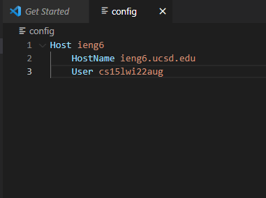
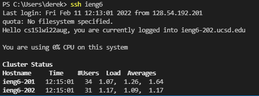
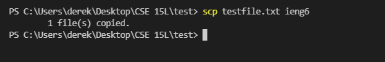

# Derek Ma Lab Report 3

Hello! This lab report demonstrates the process of streamlining the ssh configuration.

# Streamlining ssh Configuration

Here is the config file, and I created and edited this file through VScode.

The alias I chose was simply ieng6, so now I am able to log in to my account by simply typing `ssh ieng6`

Here is an example of the scp command copying a file to my account from my local device, using ieng6. I created a test text file called `testfile.txt` and I was able to successfully copy it to ieng6 using the scp command.

