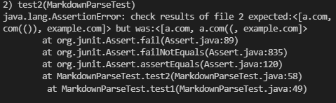

# Derek Ma Lab Report 4

Hello! This lab report reviews 3 snippets of code on 2 different
implmentations of MarkdownParse.

# Links to both MarkdownParse directories

[Link to reviewed MarkdownParse repository](https://github.com/artballesteros/markdown-parse)

[Link to my MarkdownParse repository](https://github.com/Prodlax/markdown-parse)

# Snippet 1

## Snippet Preview

`[a link`](url.com)

[another link](`google.com)`

[`cod[e`](google.com)

[`code]`](ucsd.edu)

## Test method in MarkdownParseTest.java

## Output of my implmentation

My implmentation did not pass.

## Output of reviewed implementation

Reviewed implmentation did not pass.

# Snippet 2

## Snippet Preview

[a [nested link](a.com)](b.com)

[a nested parenthesized url](a.com(()))

[some escaped \[ brackets \]](example.com)

## Test method in MarkdownParseTest.java

## Output of my implmentation

My implmentation did not pass.

## Output of reviewed implementation

Reviewed implmentation did not pass.

# Snippet 3

## Snippet Preview

[this title text is really long and takes up more than 
one line

and has some line breaks](
    https://www.twitter.com
)

[this title text is really long and takes up more than 
one line](
    https://ucsd-cse15l-w22.github.io/
)

[this link doesn't have a closing parenthesis](github.com

And there's still some more text after that.

[this link doesn't have a closing parenthesis for a while](https://cse.ucsd.edu/

)

And then there's more text

## Test method in MarkdownParseTest.java

## Output of my implmentation

My implmentation did not pass.

## Output of reviewed implementation

Reviewed implmentation did not pass.

# Questions

## Do you think there is a small (<10 lines) code change that will make your program work for snippet 1 and all related cases that use inline code with backticks? If yes, describe the code change. If not, describe why it would be a more involved change.

No. I think it will be a more involved change since we will need rigorous testing of many edge cases that involve many weird and creative ways of unusual combinations of backticks, far more than just a few that we can list in a few days. With the amount of cases that our code doesn't work, the decision to go back to the drawing board and start over, and thinking of a different approach may be appropriate instead.

## Do you think there is a small (<10 lines) code change that will make your program work for snippet 2 and all related cases that nest parentheses, brackets, and escaped brackets? If yes, describe the code change. If not, describe why it would be a more involved change.

A fix under 10 lines of code may be possible, but it may be very difficult. There are ways to keep track of nested parenthesis, brackets, and escaped brackets. It might be possible to use a stack of some sort that pushes an open bracket/parenthesis on top, and pops whenever a closed parenthesis closes the right parenthesis. However, this is still highly hypothetical and still might not work.

## Do you think there is a small (<10 lines) code change that will make your program work for snippet 3 and all related cases that have newlines in brackets and parentheses? If yes, describe the code change. If not, describe why it would be a more involved change.

This may be possible in under 10 lines. Since we are only trying to detect newlines, we can program the application to behave in a certain way when it encounters a newline character. According to other markdown preview applications, having a new line in the brackets break the link anyways, so the behavior might be just to not put that specific element in the list when it encounters a newline character.