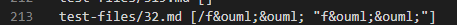
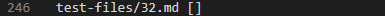
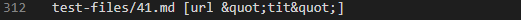
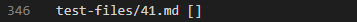
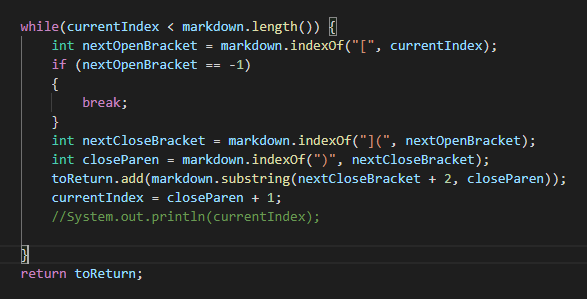

# Derek Ma Lab Report 4

Hello! This lab report compares 2 different tests from the 652 commonmark-spec tests, with two different results with my implementation and the implementation that was given in lab 9.

To find these different results, I looked at the 2 results.txt files manually and found the test cases that had different test outputs.

# File one

The first test file is 32.md. This test file should output a list with the one link "/f%C3%B6%C3%B6" (according to the html file that corresponds with this markdown file).

## My implementation

## Given implementation

## Analysis

It seems that neither implementation is correct. The expected output is one link with the contents "/f%C3%B6%C3%B6", however,
my implmentation outputs one link with the contents "/f&ouml;&ouml; "f&ouml;&ouml;"", while the given implmentation returns no links. 

I'm going to choose my implementation to describe the bug. For my implementation, I think the issue is that we are not accounting for 'ö' symbols. Based on the information, it seems like when encoding a URL, each 'ö' symbol gets encoded to '	%C3%B6', however, for our Markdown file, it gets encoded into '&ouml;'. To fix this, we would need to ADD something that accounts for specially encoded characters (there's no specific section of the code that needs to be fixed as this is a bug that results in something that we overlooked in implementation).

# File two

The second file is 41.md. This test file should output no links, as it should just display "``[a](url "tit")``" as text. 

## My implmentation

## Given implmentation

## Analysis

The given implmentation is correct in this case, since we expect no links, and the given implmentation outputs no links indeed. My implmentation is wrong because it puts a link in the ArrayList.

The bug that causes my implmentation to be incorrect would be the lack of accounting for spaces within the URL. The program should know and understand that, if the URL has a space, it is not a valid URL. So, if there is a space in the URL portion of the markdown file, the program should not display the link, as the link cannot have a space. 

The while loop in the code should be the portion that should be fixed. In the while loop, we should add an if statement that tells the program to do something different/specific when it encounters a space within the markdown parse file that is also where we are supposed to be parsing through the URL.

